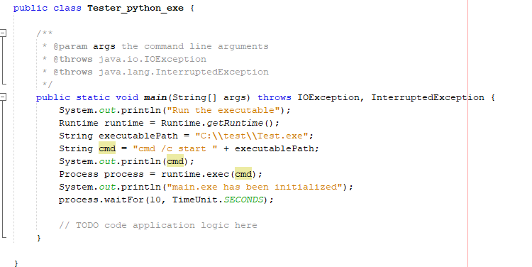
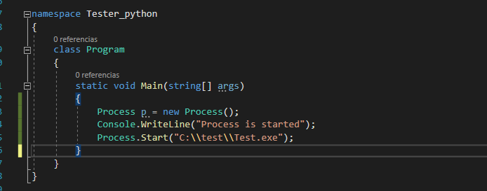

<h1 style="color: #00ff99;"> Redeco - Redeban</h1>

Repositorio del desarrollo de software en Python que permite la comunicación con los datáfonos de **Redeban Multicolor S.A.** 

Apesar de que **Redeco** esta desarrollado en python, el ejecutable que se entrega es un <strong> .exe </strong> que puede ser ejecutado desde Windows XP/7/10. Además, puede ser ejecutado desde software desarrollados en *Java* y *.NET*.

    Ejemplo de como correr el ejecutable desde Java


    Ejemplo de como correr el ejecutable desde C#




<h2 style="color: #00ff99;">Estructura de Redeco</h2>

**Redeco** esta construido en tres partes: *redeco_controller*, *redeco_view* y *redeco_core con la finalidad de facilitar la mantenibilidad y flexibilidad del software, debído que algunos cambios no afectan todo el universo del software. Por lo que cada parte se describe de la siguiente manera:

* redeco_controller: Encargado de iniciar el ejecutable de redeco_view y redeco_core en subprocesos independientes.

* redeco_view: Encargado de presentar la interfaz gráfica.

* redeco_core: Encargado de la comunicación con el datáfono, así mismo, encargado de construir e interpretar los mensajes hacia o desde el datáfono.

<h1 style="color: #00ff99;"> Pyinstaller</h1>

    Pyinstaller es la librería que permite transformar el código Python en un ejecutable, .exe para Windows o sh para Linux, consiguiendo ser iniciado en diversas plataformas sin la necesidad de tener instalado Python.


Crear ejecutable que incluya los siguientes puntos:

* Paquetes propios ➡ --paths 
* Imagenes que necesite el software (Opcional) ➡ --add-data
* Archivos de configuracion necesarios ➡ --add-data
* Icono de la empresa ➡ --icon
* Sin consola en segundo plano ➡ --windowed
* Con el nombre "redeco_core" ➡ --name 
* Reemplazar todo ➡ -y
* Ubicación de salida para el ejecutable ➡ --distpath 

Por ejemplo:

> pyinstaller ./redeco_core/main.py -p ./redeco_core/utils/ --add-data "./assets;assets" --add-date "./*.json;." --icon=./assets/favicon.ico --windowed --name redeco_core -y --distpath ../dist

Se pueden encontrar más opciones para la instalación en esta [liga](https://pyinstaller.readthedocs.io/en/stable/usage.html)

<span style="color:#ffcb32">
    <strong>⚠ADVERTENCIA⚠
    
    Se debe comentar la ruta de desarrollo y descomentar la ruta de desarrollo.
</strong>
</span>
Por ejemplo:

```python
# DEVELOPER PATH
# current_path = path.dirname(path.dirname(path.abspath(__file__)))
# PRODUCTION PATH
current_path = path.dirname(path.abspath(__file__))
```


    Para generar los compilados siga las siguientes instrucciones de acuerdo al sistema operativo que está
    utilizando. Se debe mencionar que para generar los compilados, hay que estar ubicado en la ruta principal del
    proyecto. Si se encuentra en alguna carpeta como: redeco_core, redeco_view, redeco_controller, test o asset deberá ir una carpeta atrás utlizando "cd .."

<h3 style="color: #00ff99;">Generar compilado para redeco_core </h3>


Windows

    > cd redeco_core/
    > pyinstaller.exe main.py -p utils/ --add-data "../*.config.json;." --add-data "../assets;assets" --name redecore --windowed --icon ../assets/favicon.ico -y --distpath ../dist 

Linux

    > cd redeco_core/
    > pyinstaller main.py -p utils/ --add-data "../*.config.json:." --add-data "../assets:assets" --name redecore --windowed --icon ../assets/favicon.ico -y --distpath ../dist 

<h3 style="color: #00ff99;">Generar compilado para redeco_view</h3>

Windows

    > cd redeco_view/
    > pyinstaller.exe main.py -p utils/ --add-data "../*.config.json;." --add-data "../assets;assets" --name redeview --windowed --icon ../assets/favicon.ico -y --distpath ../dist 

Linux

    > cd redeco_view/
    > pyinstaller main.py -p utils/ --add-data "../*.config.json:." --add-data "../assets:assets" --name redeview --windowed --icon ../assets/favicon.ico -y --distpath ../dist 

<h3 style="color: #00ff99;">Generar compilado para redeco_controller</h3>

Windows

    > cd redeco_controller/
    > pyinstaller.exe main.py -p utils/ --add-data "../*.config.json;." --add-data "../assets;assets" --name redeban --windowed --icon ../assets/favicon.ico -y --distpath ../dist 

Linux

    > cd redeco_controller/
    > pyinstaller main.py -p utils/ --add-data "../*.config.json:." --add-data "../assets:assets" --name redeban --windowed --icon ../assets/favicon.ico -y --distpath ../dist 